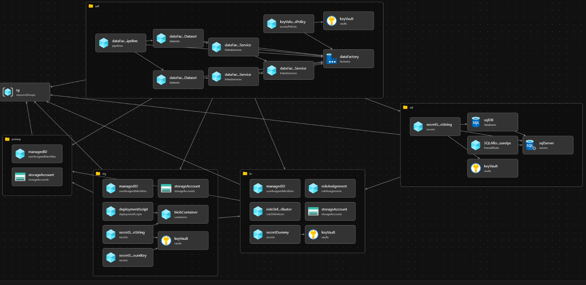

# IaC
## Bicep files to automate standard KiZAN Azure Data Factory deployment

`parameters.jsonc` - parameters used by all modules
* currently holds names of various resources (i.e. resource-group, key-vault, etc.) used in deployment

`main.bicep` - main, controlling deployment script
* Creates resource-group in which all resources are placed
* passes parameters from parameter file to modules as required
* calls various deployment modules 

`prereqs.bicep` - deploy baseline depenent resources that must exist for other resources to be deployed successfully. Dependency mechanism (Parent and DependsOn properties) not consistently acting as expected. Some resource deployments are attempted before required resource deployments complete. Putting baseline objects in separate module and making other modules dependent on this module is a work-around. If dependency issue is resolved, these resources would be better deployed in other modules with similar resources (i.e. Storage Account with blob container and other file resources)
* Storage account used by other modules
* User Assigned Managed Identity to handle required permissions later in the deployment

`kv.bicep` - create key vault used by Data Factory

`stg.bicep` - Create storage and file resources
* Create default container in storage account created in prereqs. Create storage account here if dependency issue resolved
* Deployment sccript to copy sample CSV file to container. Sample file used in ADF pipeline example.
* Store secrets for Storage Account Access Key and Connection String in key-vault

`sql.bicep:`
* Create SQL Server
* Create default database
* Store secrets for Database Connection String in key-vault

`adf.bicep:` - Deploy Azure data factory and various objects within the data factory. Linked Services, Datasets and Pipeline are deployed with parameters demonstrating a best-practices pattern:
* Data Factory with System Assigned Identity
* Key Vault Linked Service
* Key Vault access policy for Data Factory
* Azure Blob Service Linked Service using secrets stored in key-vault
* SQL Server Database Linked Service using secrets stored in key-vault
* CSV File dataset with Parameter to specify FileName from Azure Blob Service Linked Service
* SQL Database dataset with Parameter for TableName from SQL Server database Linked Service
* CopyData Pipeline - pipeline to copy data from CSV dataset to SQL dataset; pipeline has parameters for CSV source file and SQL destination table that flow from pipeline to dataset.

